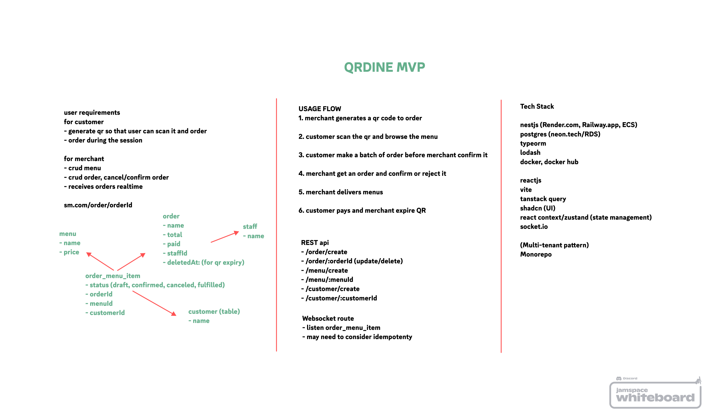
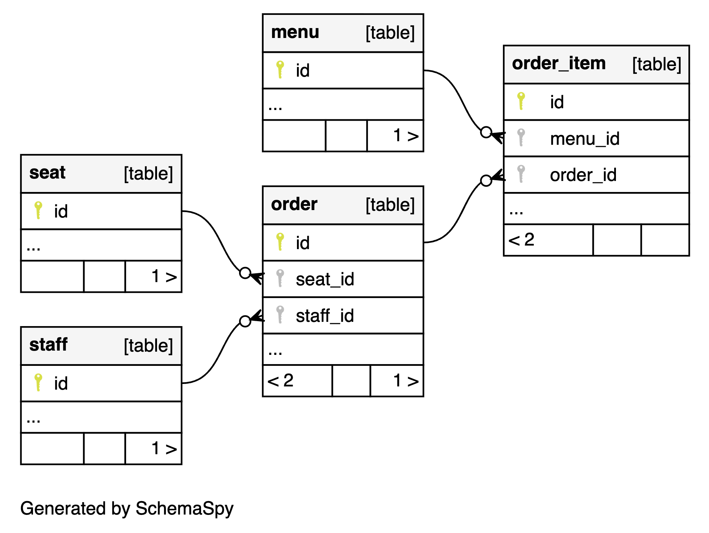

# QR Dine

Restaurant order management makes easy.

### development

- install docker
- copy `.env.example` to `.env`
- run `npm run dev`
- run `npm run cli dev-setup` to setup databases
- graphql playground is available at `http://{host}:{port}/graphql`
- please read onboarding.md for more details

### note

- restart `docker compose` after making changes in .env
- lodash default import doesn't work should be imported as `* as _`
- typeorm @Column default does not set default value

&nbsp;

# Onboarding

## glossary

- **merchant**: a business that uses our platform to manage their products and orders

## Database Architecture

### multi-tenant hybrid approach

- The system use multi-schema approach for managing merchant data. Merchants data will be assigned to a unique schema in hub database. Using multi-schema simplify deployment and reduce cost that benefits in early-state.

### `hub` database

- stores metadata of trial merchants

## graphql and typeorm

### creating/modifying a table

- modify sql file
- create a Typeorm entity (It also defines Graphql type)
